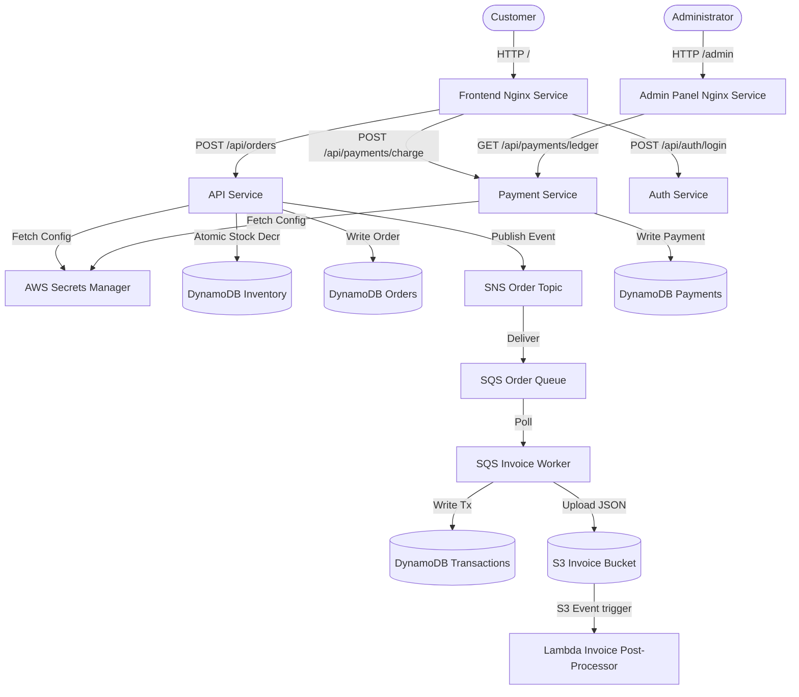

# E-Commerce Cloud Platform

This repository contains a local Kubernetes-native E-Commerce application utilizing **LocalStack Pro** for AWS service emulation and **Minikube** for container orchestration, automatically deployed via **ArgoCD**.

---

## 🏗️ Architecture Overview

The system is split into independent microservices and UI views:



### Microservices:
1. **Frontend (`frontend`)**: Simple Nginx server hosting the customer shopping panel.
2. **Admin Dashboard (`admin`)**: Nginx server hosting the operations management panel.
3. **Auth Service (`auth-service`)**: Node.js app validating user/admin logins.
4. **API Service (`api-service`)**: Node.js app processing product inventory catalog lookups and order placements.
5. **Payment Service (`payment-service`)**: Node.js app handling order charges and the global payment ledger.
6. **SQS Worker (`worker`)**: Background worker processing ordered events, writing invoices to S3, and updating ledgers.

---

## 🔐 Credentials (Default Auth)

To log in to the web panels, use the following credentials:

* **Customer Storefront (`/`)**:
  * Username: `user`
  * Password: `user123`
* **Admin Console (`/admin`)**:
  * Username: `admin`
  * Password: `admin123`
* **ArgoCD Console (`argocd.localhost`)**:
  * Username: `admin`
  * Password: Retrieve the auto-generated initial password from the cluster:
    ```bash
    kubectl -n argocd get secret argocd-initial-admin-secret -o jsonpath="{.data.password}" | base64 -d; echo
    ```

---

## 🌐 Local URLs & Access Points

* **Customer Storefront**: [http://localhost/](http://localhost/)
* **Admin Console**: [http://localhost/admin](http://localhost/admin)
* **Grafana Dashboards**: [http://localhost/grafana/](http://localhost/grafana/) (Ingress routed)
* **ArgoCD Web Console**: Accessible directly without port-forwarding: [http://argocd.localhost/](http://argocd.localhost/) (Note: Browsers automatically resolve `.localhost` subdomains to `127.0.0.1` locally, so no `/etc/hosts` changes are required).

---

## 🛠️ Verification & Operations Commands

### 1. View Pods Status
```bash
kubectl get pods -w
```

### 2. Tail Microservice Logs
```bash
kubectl logs -f -l app=api
kubectl logs -f -l app=worker
kubectl logs -f -l app=payment
kubectl logs -f -l app=auth
```

### 3. Check DynamoDB Tables
```bash
aws dynamodb list-tables --endpoint-url http://localhost:4566 --region us-east-1
```