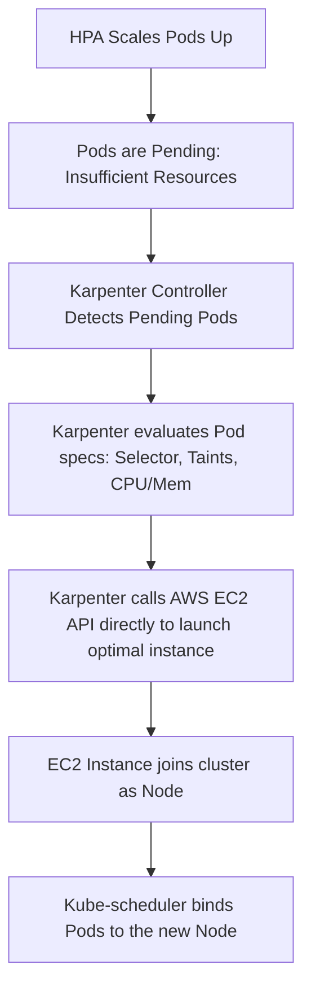

# Kubernetes Node Autoscaling: Understanding Karpenter

This document explains the concept of node autoscaling in Kubernetes and details why **Karpenter** is preferred over the traditional Kubernetes Cluster Autoscaler, especially for modern, dynamic cloud architectures like E-Commerce platforms.

---

## 1. What is Node Autoscaling?

In Kubernetes, autoscaling operates at two distinct layers:

1. **Pod Autoscaling (Software Layer)**: Evaluated by the **Horizontal Pod Autoscaler (HPA)**. It adjusts the number of pod replicas running based on metric thresholds (such as CPU, Memory, or custom API metrics).
2. **Node Autoscaling (Hardware/Infrastructure Layer)**: Evaluated when the cluster runs out of physical capacity. If the HPA scales replicas up but there are no free nodes to run them, pods enter a `Pending` state. The Node Autoscaler detects this and provisions new virtual machines (e.g., EC2 instances) to expand the cluster.

---

## 2. Cluster Autoscaler (Traditional) vs. Karpenter (Modern)

Historically, Kubernetes on AWS utilized the **Cluster Autoscaler (CA)**. **Karpenter** was built to solve the architectural bottlenecks and limitations inherent to CA.

| Feature | Cluster Autoscaler (CA) | Karpenter |
| :--- | :--- | :--- |
| **Cloud Interface** | Scales EC2 Auto Scaling Groups (ASGs) | Talks directly to the AWS EC2 API |
| **Nodegroups** | Requires pre-defined static nodegroups | **Group-less**: Dynamically selects instances |
| **Provisioning Speed**| Slow (minutes; has to trigger ASG, wait for launch) | Fast (seconds; direct API calls to launch EC2) |
| **Instance Selection**| Restricted to predefined types inside the ASG | Picks dynamically from all EC2 types based on Pod specs |
| **Cost Optimization** | Basic node termination | Active consolidation (bin-packing & spot purchasing) |

---

## 3. How Karpenter Works Under the Hood

Karpenter operates as a controller running inside your EKS/Kubernetes cluster. Its workflow is simple:



1. **Watching Pending Pods**: Karpenter bypasses the Kubernetes scheduler constraints and monitors the API server for pods that cannot be scheduled due to resource limitations.
2. **Analyzing Requirements**: It reads the pod's `resources.requests`, `nodeSelector`, `affinity`, `tolerations`, and topology rules.
3. **Direct Provisioning**: It instantly calls the EC2 Fleet API to create a new instance matching those exact needs (e.g., if a pod tolerates `spot` instances and needs `ARM64` CPU, Karpenter provisions an `m6g.medium` Spot instance).
4. **De-provisioning (Consolidation)**: Karpenter continuously analyzes the cluster. If it finds that pods can fit on fewer, smaller, or cheaper instances, it automatically migrates the pods and terminates the redundant/over-provisioned nodes.

---

## 4. Why We Use Karpenter in E-Commerce Platforms

E-Commerce workloads are highly volatile. Flash sales, seasonal events (like Black Friday), or marketing campaigns cause massive, unpredictable traffic spikes.

### Key Benefits for E-Commerce:

* **Saves Money (Optimized Spot Utilization)**: During low-traffic hours, Karpenter automatically consolidates your workloads onto a few cheap On-Demand nodes. When traffic spikes, Karpenter can rapidly provision cheaper Spot instances for stateless frontend and API replicas.
* **Instant Scale-Up**: Traditional autoscalers take several minutes to launch new nodes. If a flash sale starts, customers will experience latency or 503 errors while waiting for nodes to spin up. Karpenter provisions nodes in under a minute.
* **Diverse Hardware Support**: E-Commerce architectures run diverse workloads. For example:
  - Frontend/API pods can run on cheap **ARM64** nodes.
  - SQS Workers might run on memory-optimized instances.
  - Machine Learning recommendations pods can dynamically provision **GPU** nodes only when required.
  Karpenter handles all of these dynamically without you having to pre-configure and manage dozens of separate Auto Scaling Groups.

---

## 5. Karpenter Configuration Basics

Karpenter is configured using two Custom Resources:

1. **NodePool**: Defines *how* Karpenter provisions nodes (e.g., which instance families, zones, purchasing models, and CPU architectures are allowed).
2. **EC2NodeClass**: Defines AWS-specific configuration for the provisioned nodes (e.g., AMI family, security groups, subnets, and IAM roles).

### Example NodePool configuration:
```yaml
apiVersion: karpenter.sh/v1beta1
kind: NodePool
metadata:
  name: default
spec:
  template:
    spec:
      requirements:
        - key: karpenter.sh/capacity-type
          operator: In
          values: ["spot", "on-demand"]
        - key: kubernetes.io/arch
          operator: In
          values: ["amd64", "arm64"]
        - key: karpenter.k8s.aws/instance-category
          operator: In
          values: ["c", "m", "r"]
  disruption:
    consolidationPolicy: WhenUnderutilized
    expireAfter: 720h
```

---

## 6. Implementation Guide for Our E-Commerce Platform

Because Karpenter communicates directly with the AWS EC2 Fleet API to create and delete physical VMs, **Karpenter cannot be run locally inside Minikube/Docker**. 

To deploy Karpenter in a production E-Commerce setup, we would implement it on a real **AWS EKS (Elastic Kubernetes Service)** cluster using the following steps:

### Step 1: Provision EKS Cluster & IAM Roles (Terraform)
Karpenter needs permissions to launch EC2 instances on behalf of the EKS cluster. In Terraform, we define:
1. **IAM OIDC Provider**: Configures Trust relationship between EKS and AWS IAM.
2. **Karpenter Controller IAM Role (IRSA)**: Grants Karpenter controller permission to call EC2 APIs.
3. **EKS Node IAM Role**: The standard role attached to EC2 instances provisioned by Karpenter so they can join the EKS cluster.

```hcl
# Example Terraform snippet for Karpenter Controller IAM Role
module "karpenter" {
  source  = "terraform-aws-modules/eks/aws//modules/karpenter"
  version = "~> 20.0"

  cluster_name = module.eks.cluster_name

  enable_irsa                     = true
  irsa_oidc_provider_arn          = module.eks.oidc_provider_arn
  irsa_namespace_service_accounts = ["karpenter:karpenter"]

  create_node_iam_role = true
}
```

### Step 2: Tag VPC Subnets and Security Groups (Terraform)
Karpenter needs to discover where to launch new nodes. We tag EKS subnets and security groups so Karpenter can identify them:
```hcl
# Tags on Subnets
tags = {
  "karpenter.sh/discovery" = "my-eks-cluster-name"
}
```

### Step 3: Install Karpenter Helm Chart (ArgoCD / Helm)
We deploy Karpenter into EKS using its official Helm chart. In ArgoCD, we register the Karpenter application using:
- **Repo URL**: `oci://public.ecr.aws/karpenter/karpenter`
- **Values**: Setting the cluster name, cluster endpoint, and service account IAM role annotation.

```yaml
# Helm values example
serviceAccount:
  annotations:
    eks.amazonaws.com/role-arn: arn:aws:iam::111122223333:role/KarpenterControllerRole
settings:
  clusterName: my-eks-cluster-name
  clusterEndpoint: https://example.gr7.us-east-1.eks.amazonaws.com
```

### Step 4: Deploy Karpenter NodePool & EC2NodeClass
Once the Karpenter pod is running in EKS, we apply the NodePool and EC2NodeClass manifests to start autoscaling:
```yaml
apiVersion: karpenter.k8s.aws/v1beta1
kind: EC2NodeClass
metadata:
  name: default
spec:
  amiFamily: AL2 # Amazon Linux 2
  role: KarpenterNodeRole-my-cluster # IAM Role created in Step 1
  subnetSelectorTerms:
    - tags:
        karpenter.sh/discovery: my-eks-cluster-name
  securityGroupSelectorTerms:
    - tags:
        karpenter.sh/discovery: my-eks-cluster-name
```
With these in place, any pods matching the requirements (e.g., our scaled E-Commerce API replicas) will immediately trigger Karpenter to launch new EC2 instances directly into EKS!

